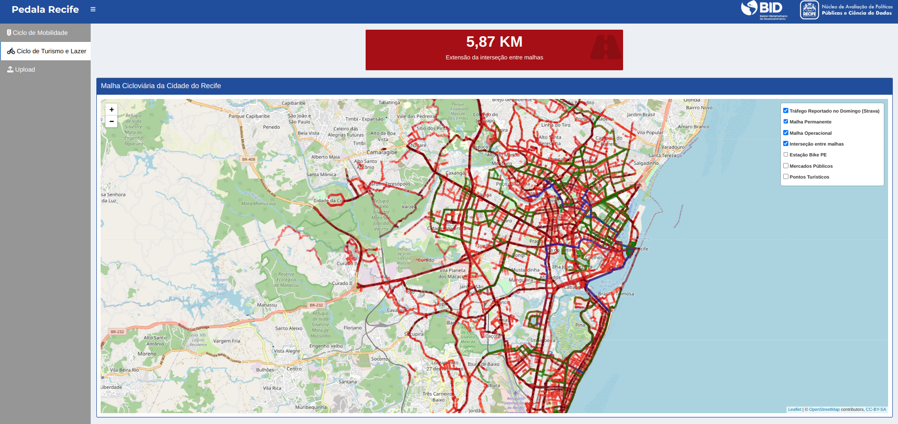
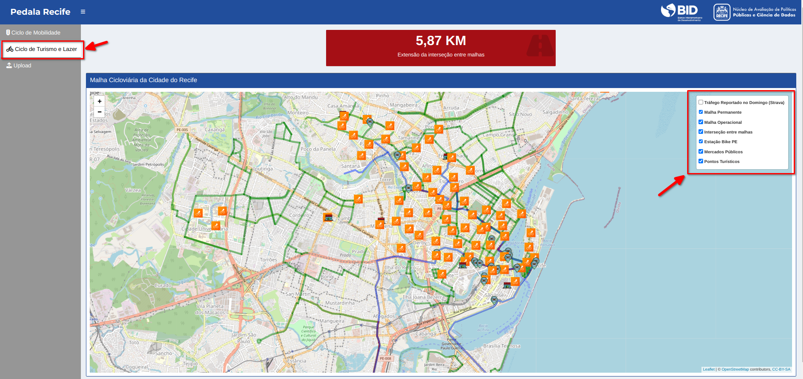
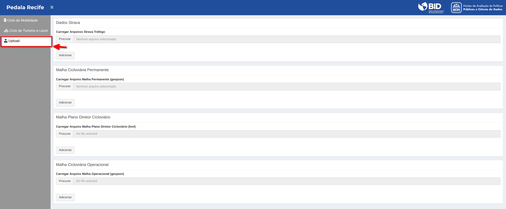

# PoC Ciclo de Turismo e Lazer



## Tabela de Conteúdo:
---

- [Descrição](#descricao)
- [Guia do usuário](#guia-do-usuario)
- [Guia de instalação](#guia-de-instalacao)
- [Autores](#autores)
- [Licença](#licenca)

## Descrição <a name="descricao"></a>
---

Para contribuir para o debate sobre política de turismo e lazer da cidade do Recife
foi desenvolvida uma solução que tem como objetivo analisar como a malha 
cicloviária operacional complementa a malha cicloviária permanente com o 
intuito de fornecer maior extensão de trechos cicláveis para a população 
durante os Domingos e Feriados. 

Os principais objetivos dessa solução são:

- Analisar o tráfego de ciclistas durante o Domingo e Feriados;
- Analisar como as malhas cicloviárias permantes e operacionais dão suporte ao fluxo de ciclistas;
- Contabilizar pontos de interseções entre a malha permanente e operacional;
- Auxiliar a Secretaria de Turismos a formular a implementação da malha cicloviária operacionais para que conecte os principais pontos turísticos da cidade.

Assim como na PoC de Ciclo de Mobilidade, foram utilizados os seguintes conjunto de dados:

- **Strava Metro**: banco de dados com informações autorreportadas dos trajetos de bicicleta dos usuários do aplicativo Strava para o ano de 2021;
- **Malha Cicloviária Permanente e Operacional**: conjunto de arquivos shape indicando a localização da malha cicloviária da cidade do Recife (ano de 2022);
- **Estações Bike PE**: conjunto de dados com a localização das estações de bicicletas compartilhadas.
- **Estações Salva Bike**: conjunto de dados com a localização de pontos de apoio para manutenção de bicicletas;
- **Informações sobre Pontos Turísticos da cidade do Recife**: informações sobre alguns pontos turísticos georeferenciados da cidade do Recife;
- **OpenStreetMap**: banco de dados de mapas, colaborativo e gratuito.


## Guia do Usuário <a name="guia-do-usuario"> </a>
---

O principal objetivo dessa solução é analisar o tráfego de ciclistas nos fins de 
semana e como as malhas cicloviárias auxiliam nesse fluxo, assim como, contabilizar pontos de interseções entre a malha permanente e operacional e auxiliar a Secretaria de Turismos a formular a implementação da malha cicloviária operacionais para que conecte os principais pontos turísticos da cidade.



Semelhante ao mapa demonstrado na solução de Ciclo de Mobilidade, a Figura 7 mostra a funcionalidade do mapa, no qual é possível observar as malhas permanentes e operacionais, sua interseção, e como elas conectam os principais pontos turísticos da cidade do Recife. 

Por fim, há uma seção de **Upload** de arquivos no qual a prefeitura do Recife pode realizar as atualizações de toda a aplicação com o carregamento de novas versões dos arquivos.



## Guia de Implementação  <a name="guia-do-implementacao"> </a>
---


A implementação da aplicação é bastante simples e seguirá três passos simples. São eles:

1. Download do software R e as bibliotecas necessárias;
2. Download dos códigos-fonte da aplicação;
3. Execução da aplicação.

## 1. Download de software:

A aplicação foi escrita na linguagem [R](https://www.r-project.org/) e utilizando as seguintes bibliotecas para a criação do dashboard:

- shiny;
- shinydashboard;
- shinydashboardPlus;
- shinyWidgets;
- data.table;
- tidyverse;
- lubridate;
- leaflet;	
- arrow;
- fresh;
- DT;
- sf;
- rgdal;
- raster;
- geojsonsf;
- waiter;

Após a instalação do R e das bibliotecas listadas anteriormente, o próximo é obter os arquivos da aplicação.

## 2. Clonando repositório remoto: 

É possível realizar o download dos arquivos da aplicação através do repositório remoto do GitHub. Através da linha de commando:

```sh
git clone <url>
```

## 3. Executando a aplicação:

Com os bancos de dados no formato apropriado e salvo nas respectivas pastas, basta executar o arquivo `app.R`. Através da linha de comando:

```sh
Rscript app.R
```


## Autores <a name="autores"></a>
---

- [Cleyton Farias](mailto:cleytonfarias@outlook.com "e-mail");

- [Rubens Lopes](mailto:lps.rubens@gmail.com "e-mail");


## Licença
---
